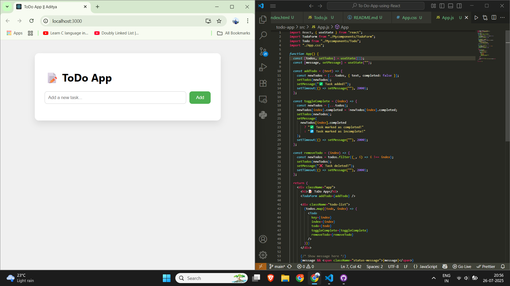

# 📝 ReactJS ToDo App

A simple and clean ToDo List application built with **ReactJS**. This app allows users to:

- ➕ Add new tasks
- ✅ Mark tasks as complete
- ❌ Delete tasks
- 📢 See action messages like "Task Added" or "Task Deleted"

---

## 🔧 Tech Stack

- ⚛️ ReactJS (Frontend)
- 🎨 CSS for styling
- 🧠 React Hooks (`useState`) for state management

---

## 🚀 Features

- ✅ Real-time task updates
- ✍️ Input field for adding new tasks
- 🧼 Clean and modern UI
- 🔁 Toggle complete/incomplete
- ❌ Delete tasks from the list
- 📢 Status message below form (Task added/deleted)

---

## 📁 Folder Structure

# 📝 ReactJS ToDo App

A simple and clean ToDo List application built with **ReactJS**. This app allows users to:

- ➕ Add new tasks
- ✅ Mark tasks as complete
- ❌ Delete tasks
- 📢 See action messages like "Task Added" or "Task Deleted"

---

## 🔧 Tech Stack

- ⚛️ ReactJS (Frontend)
- 🎨 CSS for styling
- 🧠 React Hooks (`useState`) for state management

---

## 🚀 Features

- ✅ Real-time task updates
- ✍️ Input field for adding new tasks
- 🧼 Clean and modern UI
- 🔁 Toggle complete/incomplete
- ❌ Delete tasks from the list
- 📢 Status message below form (Task added/deleted)

---

## 📁 Folder Structure

todo-app/
│
├── src/
│ ├── App.js
│ ├── TodoForm.js
│ ├── Todo.js
│ ├── App.css
│ └── index.js
├── public/
│ └── index.html
└── README.md

📸 Screenshot:

## Install dependencies: (npm install)

## Start the development server: (npm start)

## Open http://localhost:3000 to view the app in your browser.